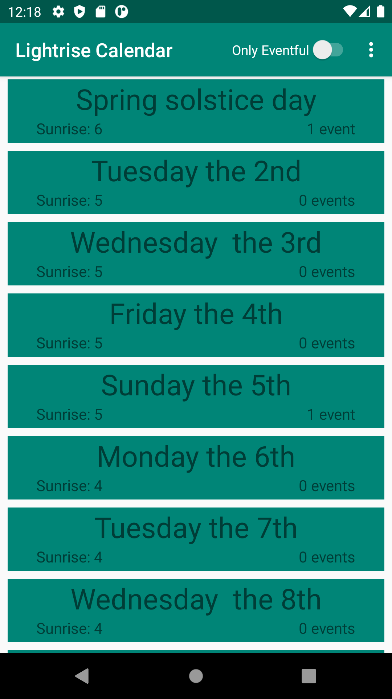
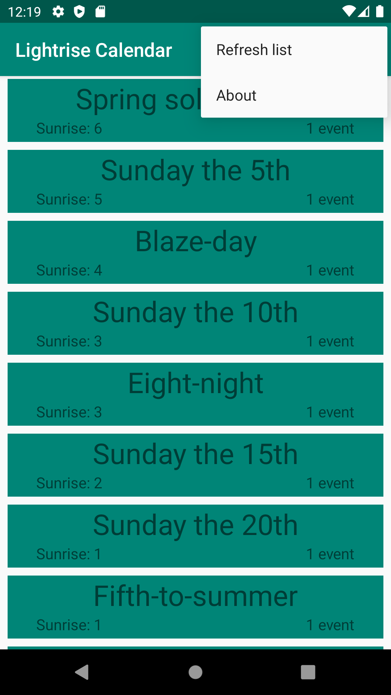
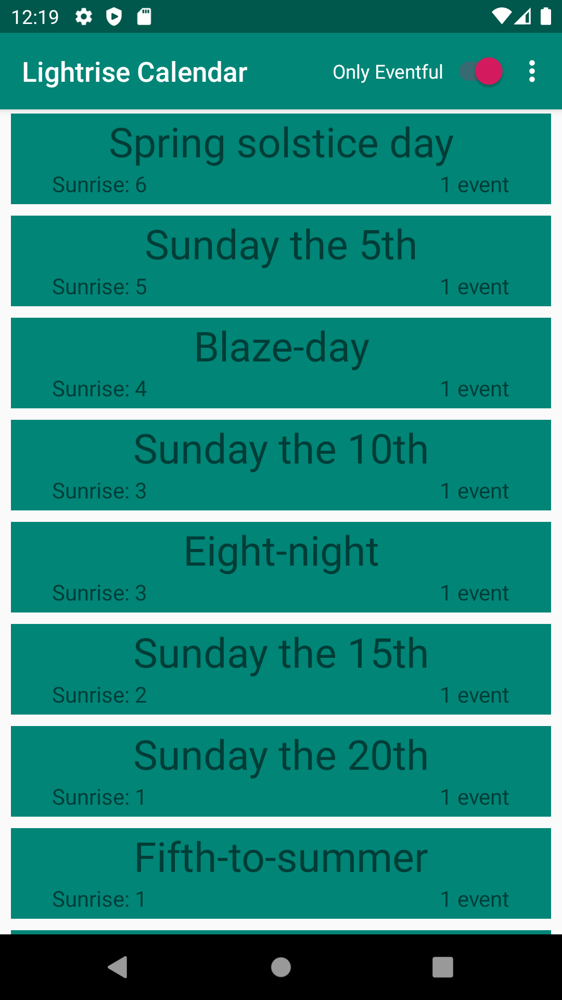

# Report
The app was decided to be usable as a calendar for a fictional world of my own creation. Specifically for one of the world months.
This month has 25 days and notably the amount of daylight goes from 12 hours on the first of the month and on the last and 25th the sun does
not set at all. Thus the app should display the time of sunset and sunrise. Additionally some days have specific names that it is called in
conversation instead of the days date. Further there are events that occur on some days and these should also be displayed in the app.
### Sketch/design
The design of the app was naturally made to fill these decided requirements of the app as well as the given requirements from the task.
The given requirements on the design were, at large, to show multiple pieces of information on every entry in a list of many of any thing.
This thing in this case is naturally a day. Further there should be a type of filter that can be activated to only show some of the entries.
Further there should be a screen that displays information about for who the app is useful. Lastly every list-item should be clickable at which
point a new screen with more information of the said item should be shown.

In this case the design was designed as follows (See also sketch below). On the main screen there should be a list of days where each list-item
should show the name of the day, the hour at which the sun rises as well as the amount of events on that day. If the said day does not have a
unique day-name the day should say which weekday and date the day is. Further on the main screen there should, in the top toolbar, a switch
for activating or deactivating a filter which shows only the days that have at least one event. On the toolbar there should also be an icon
of buttons that when clicked opens a window from which it can be chosen to show the about-screen or to reload the list from the webservice.

The about-screen should have the header "about" and should then show a brief text explaining that the app is indeed only interesting for
a person with interest in this particular month of this particular world and it's events.

The detailed screen that will appear when a list-item is clicked should prominently show the name of the day, following the same conventions
discussed earlier. The date of the day should also be displayed as well as the full time that the sun sets and rises. Lastly it should show a
list of the names of all the events that occur on that specific day.

### Webservice - JSON
The JSON-data used in the course was entered according to the course standard but naturally the different fields were used for things relevant
to this app. ID and type (often called login in the course material) were said not to be needed to be explained and thus they will not be.

Name was used to store the name of the day if it had a unique name, otherwise the field would be left empty. This was quite natural seeing as
the name was similar to the usage and thus could keep its name in deserialized form.
Company was used to store the time of sunset, this being a string could have become an issue but seeing as the app would not need to perform any
math on this data a string was not an issue. Location was used to store the time of sunrise, this too is a string but is not an issue for the
same reason as above. Both these rows used the format hour:minute to store the time. Size being an integer was naturally used to store the date
of the day. Auxdata was used to store an array of string with the names of the events on that given day. Notable is the fact that if the
deserialization (in this case gson) tries to convert an empty field to an array it will cause an error. Due to this even the days without
events has the data [] as to instead be converted to an empty array. Remaining fields were not used.

Below the data for the first day of the month is exemplified in prettyfied JSON.
```
{
	"ID": "b21eriho_d1",
	"name": "Spring solstice day",
	"type": "b21eriho",
	"company": "18:00",
	"location": "6:00",
	"category": "",
	"size": 1,
	"cost": 0,
	"auxdata": ["Spring-start feast"]
}
```
### Implementation
#### Detail 1
One notable part of the project was the fetching of data from the external database into the program. This was accomplished primarily using the "jsonTask" provided in the
course. However its implementation in the main activity was to be designed individually. The function returns a string of json which was then deserialized using gson.
To do this a token was made and the instances of the day given by gson was put in an array to be used shortly thereafter. At first this was only done by adding the array
to the array used by the recyclerview and the adapter alerted to the change 
([visible here](https://github.com/b21eriho/mobileapp-programming-project/commit/fb6d575e27b70c7f5daed131125894e9208465af)). But later it was also written to the internal
database for easier access and filtering later, this was done in
[this](https://github.com/b21eriho/mobileapp-programming-project/commit/d67cba02101cf68b382cf63a5fac3411457a4a43) commit. Code from the latest iteration of this code is
seen below (Figure 1) as well as a screenshot of the app. While it is hard to prove the data in the image is taken from the web besides showing that no day is 
hard-coded into the project this image is seen to best show this part of the implementation.

Figure 1 - excerpt from onPostExecute
```
        Type type = new TypeToken<List<Day>>() {}.getType();
        List<Day> daysFromJson = gson.fromJson(json, type);

        db.getWritableDatabase().execSQL("DELETE FROM " + DataBaseHelper.TABLE_LIGHTRISE_DAYS);

        for(int i = 0; i < daysFromJson.size(); i++){
            Day thisDay = daysFromJson.get(i);
            ContentValues values = new ContentValues();
            values.put(DataBaseHelper.COLLUMN_DATE, thisDay.getDate());
            values.put(DataBaseHelper.COLLUMN_NAME, thisDay.getName());
            values.put(DataBaseHelper.COLLUMN_SUNUP, thisDay.getSunUp());
            values.put(DataBaseHelper.COLLUMN_SUNDOWN, thisDay.getSunDown());
            values.put(DataBaseHelper.COLLUMN_EVENTS, gson.toJson(thisDay.getEvents()));
            db.getWritableDatabase().insert(DataBaseHelper.TABLE_LIGHTRISE_DAYS, null, values);

        }
```

#### Detail 2
Also of note is a feature which was added that allowed the user to refresh the data from the database, this was done mostly in case there would be new items added to the
external database during the presentation. In either case this was added on the toolbar in the same way an identical effect was made in the "webview"-dugga. The adding of
the options-icon on the toolbar was done in [this](https://github.com/b21eriho/mobileapp-programming-project/commit/f0b6fee7c6763ca48b03c2f4cf26b174d41227c5) commit. The
relevant part for this detail is the code which actually reloads the data from the database, seen below in figure 2. This is done in the function which is called whenever
an item is clicked in the list which the options-icon produces. This function does a few things, among them getting which item was clicked on as to run the right code in
response, but when the "reload"-button is hit the json-task is ran again which due to the implementation of onPostExecute clears the database and then loads it again from
the database. This implementation is shown in figure 3 below. As well as these code-excerpts there is a screenshot showing the options-icon's list.

Figure 2 - function called when item is clicked in options-menu
```
    public boolean onOptionsItemSelected(MenuItem item) {
        int id = item.getItemId();

        if (id == R.id.action_refresh_list) {
            new JsonTask(this).execute(JSON_URL);
        }

        if (id == R.id.action_show_about) {
            Intent intent = new Intent(this, AboutActivity.class);
            startActivity(intent);
        }

        return super.onOptionsItemSelected(item);
    }
```
Figure 3 - excerpt from the updateRecyclerView function which is called in onPostExecute
```
dayList.clear();
dayList.addAll(tmpDays);
adapter.notifyDataSetChanged();
```

### Implementation VG
#### Detail 3
Also of note and relevant to the recyclerview is the design of each list-item. This was done in accordance to the requirements for the higher grade. The design was made in
an XML-document in [this](https://github.com/b21eriho/mobileapp-programming-project/commit/dae25528db2b5c6eb9eed14b69ef8bf0ff8c6375) commit also shown below in figure 4.
To fill this data at runtime an adapter was naturally used in accordance to the way taught in the course by loading data from an instance of the day object into the
different fields of the list-item. Below is also an image showing these list-items, though it has been shown before.

Figure 4 - XML to design list-item
```
    <TextView
        android:id="@+id/listItemTitle"
        android:layout_width="match_parent"
        android:layout_height="wrap_content"
        app:layout_constraintTop_toTopOf="parent"
        android:gravity="center_horizontal"
        android:text="Title"
        android:textSize="30sp"/>

    <TextView
        android:id="@+id/sunTimeDisplay"
        android:layout_width="wrap_content"
        android:layout_height="wrap_content"
        android:layout_marginStart="30dp"
        android:text="Sun: 8-12"
        android:textSize="16sp"
        app:layout_constraintStart_toStartOf="parent"
        app:layout_constraintTop_toBottomOf="@id/listItemTitle" />

    <TextView
        android:id="@+id/eventAmountDisplay"
        android:layout_width="wrap_content"
        android:layout_height="wrap_content"
        app:layout_constraintEnd_toEndOf="parent"
        app:layout_constraintTop_toBottomOf="@+id/listItemTitle"
        android:text="2 Events"
        android:layout_marginEnd="30dp"
        android:textSize="16sp"/>
```
Figure 5 - Recyclerview adapter for list-item
```
    public void onBindViewHolder(@NonNull DayViewHolder holder, int position) {
        Day thisDay = days.get(position);

        if(thisDay.getName().length() != 0){
            holder.dayTitle.setText(thisDay.getName());
        }
        else{
            holder.dayTitle.setText(DayNameHelper.getNameFromDate(thisDay.getDate()));
        }

        holder.sunTime.setText("Sunrise: " + thisDay.getSunTimesShort());

        String tmp = "";
        tmp += thisDay.getEvents().size() + " event";
        if(thisDay.getEvents().size() != 1){ tmp += "s";}
        holder.nrEvents.setText(tmp);

    }
```

#### Detail 4 filter
Another interesting part of the app was the filtering of the entries. This was done using a switch-view on the main activity, XML shown below in
figure 6, which was implemented in [this](https://github.com/b21eriho/mobileapp-programming-project/commit/f0b6fee7c6763ca48b03c2f4cf26b174d41227c5) commit. The 
functionality of this sorting was implemented such that when the recyclerview was updated it would, if the switch was on, only fetch the day-entries where the auxdata
didn't consist of only an empty array from the local database. This code is shown below in figure 7. Further when the switch is clicked the new status of it is stored in
a shared preference so that it would remain where it should even if the app is closed and reopened, see figure 8 for this code. Also below is a screenshot of the app in a 
state where the data is filtered.

Figure 6 - Excerpt from activity_main defining the switch
```
<Switch
    android:id="@+id/eventfullToggle"
    android:layout_width="wrap_content"
    android:layout_height="wrap_content"
    android:text="Only Eventful"
    android:layout_gravity="end"/>
```
Figure 7 - Excerpt from MainActivity of function that returns a cursor of the data that should be loaded, boolean parameter is weather only eventful days should be loaded
```
public Cursor getDataBaseCursor(boolean onlyEventful){
    String sortQuerryString = "";
    if(onlyEventful){sortQuerryString += " WHERE " + DataBaseHelper.COLLUMN_EVENTS + " != '[]'";};

    Cursor cursor = db.getReadableDatabase().rawQuery("SELECT * FROM " + DataBaseHelper.TABLE_LIGHTRISE_DAYS + sortQuerryString + " ORDER BY " + DataBaseHelper.COLLUMN_DATE, null, null);
    return cursor;
}
```
Figure 8 - onClickListener for switch
```
public void onClick(View v) {
    myPreferenceEditor.putBoolean("onlyEventful", toggleSwitch.isChecked());
    myPreferenceEditor.apply();
    updateRecyclerView(myPreferenceRef.getBoolean("onlyEventful", true));
}
```

### Reflection
